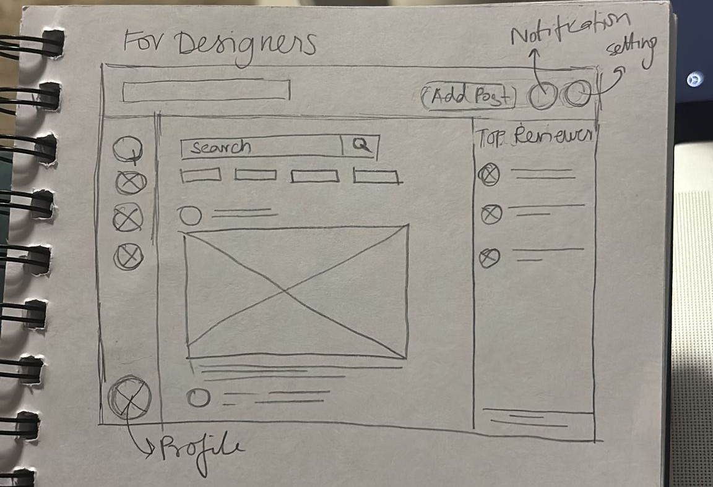
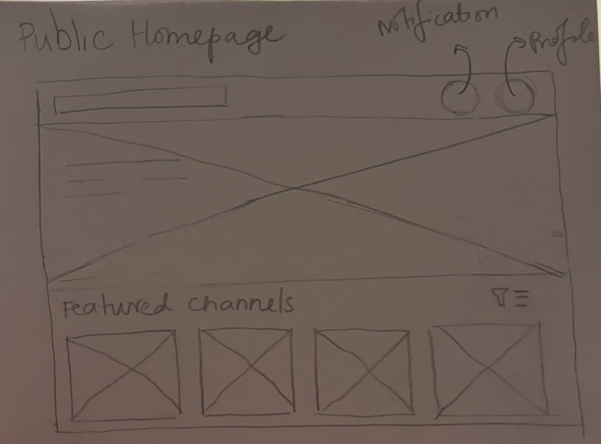

# Leveling the Playing Field

**Leveling the Playing Field** is a prototype platform designed to help game developers identify stereotypes early in the design process. Inspired by community-driven platforms like Discord and Reddit, it provides structured spaces where designers and reviewers collaborate to create inclusive, stereotype-free games.

---

## 🎯 Objective

To create a **dedicated platform** where:
- **Developers** post game assets (characters, scripts, designs).
- **Reviewers** provide structured feedback on stereotypes and representation.
- **Studios** can incentivize quality feedback through **paid reviews**.

---

## 🖼️ Platform Views

The platform has three main views:

1. **Designer/Developer View** – For posting content, managing channels, and inviting reviewers.  
   

3. **Reviewer View** – For browsing channels, joining discussions, and submitting feedback.  
   

4. **Landing Hub** – The first page after signing in, enabling users to join as reviewers or explore content passively.  
   

---

## 🛠️ Key Features

### 1. Designer/Developer Features
- **Add Post**: Upload game content (images, scripts) for review.
- **Channel Management**: Create project-specific channels for structured discussions.
- **Top Reviewers Section**: Invite reviewers directly and view profiles, achievements, and reputation.
- **Notifications & Settings**: Manage preferences, invitations, and activity alerts.

---

### 2. Reviewer Features
- **Channel Discovery**: Browse trending and new channels.
- **Structured Feedback**: Reply, react, and collaborate with other reviewers.
- **Accepted Channels List**: Quick access to channels where you’re invited.
- **Notifications & Filters**: Get real-time updates on posts and invitations.

---

### 3. Landing Hub
- **Invitation Acceptance**: Join channels as a reviewer by accepting terms.
- **Public Content Exploration**: Browse shared posts without commitment.
- **Featured Channels Section**: Curated highlights for easy discovery.

---

