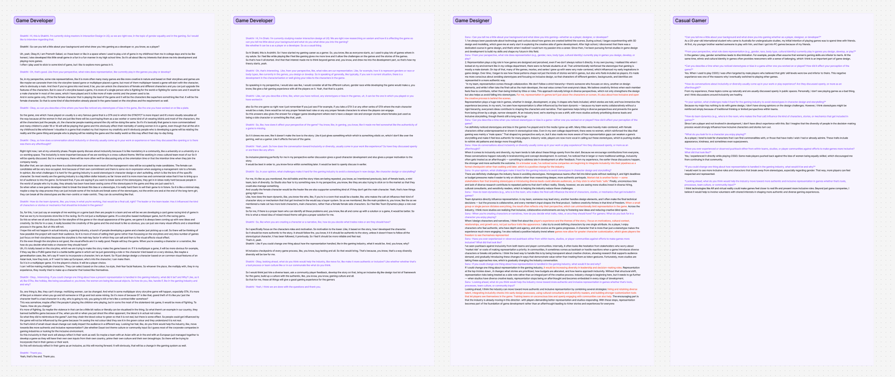
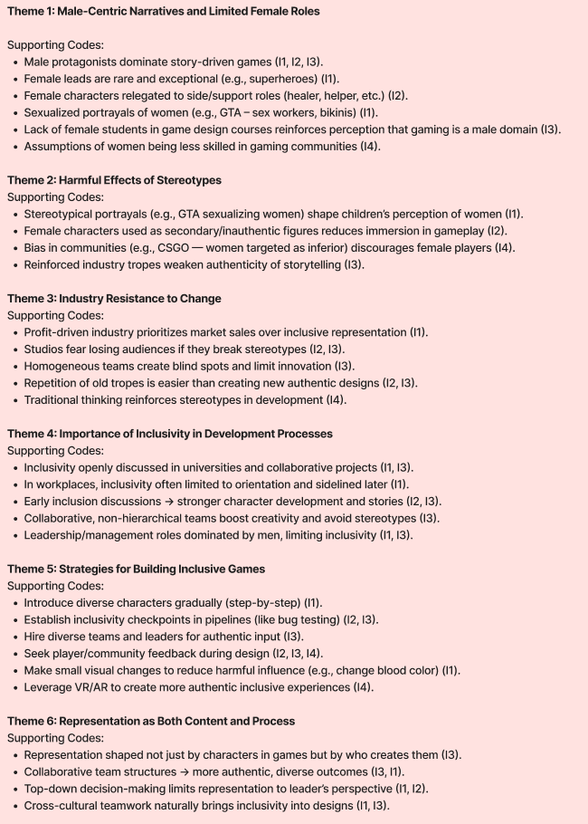

# Leveling the Playing Field: Gender Stereotypes and Sexism in Video Games

## Domain Definition
The domain examines how casual gaming culture intersects with digital social platforms and the gendered dynamics of gaming communities. Casual gamers engage in video games for leisure and often participate in parallel digital spaces (e.g., Reddit, Discord, Instagram), where social interactions, memes, and discussions shape gaming experiences.

**Key domain characteristics:**
- **Focus on casual gamers:** Individuals who engage with video games primarily for leisure rather than professionally.  
- **Impact of gender stereotypes and sexism:** Examines how biased perceptions and discriminatory behaviors shape gamers’ experiences both in-game and across digital spaces.  
- **Prevalence of normalized sexist discourse:** Highlights how gendered jokes, memes, and community norms reinforce stereotypes within casual gaming communities.  

---

## Gaps or Opportunities Identified
- **Intersectional and inclusive research:** Limited research explores compounded discrimination (e.g., women of color, LGBTQ+ players) or differential experiences across voice/text harassment.  
- **Improving reporting and moderation:** Current systems often fail to curb discriminatory behavior; better moderation and inclusive design could reduce harassment for all genders.  
- **Role models and character design:** Positive representation of both genders, with non-stereotypical portrayals, could shift attitudes and engagement across all players.  
- **AI and gender equity in technology:** Applying explainable AI (XAI) approaches could mitigate gendered biases in emerging tech, preventing reinforcement of harmful stereotypes.  

---

## Detailed Audience Characteristics
### 1. Relevant Skills and Expertise
- Game development & design (narrative, level design, UI/UX, interactive storytelling).  
- Technical: Unity/Unreal engines, version control (Git), QA/testing, C#/C++ scripting.  
- Narrative & art direction (concept art, dialogue, character modeling).  
- Team/project management (agile, scrum, sprint planning).  
- Industry awareness (representation discourse, inclusive design trends).  

### 2. Values and Priorities
- Creative integrity balanced with inclusivity.  
- Player immersion and global resonance.  
- Industry reputation and socially responsible design.  
- Efficiency: tools must integrate with existing workflows.  
- Market growth through inclusivity.  
- Team culture aligned with DEI initiatives.  

### 3. Workflows and Experiences
- Cross-functional collaboration (writers, artists, engineers, producers).  
- Iterative design loops: prototype → playtest → refine.  
- Current DEI reviews often ad-hoc or late in pipelines.  
- High-pressure deadlines (crunch culture).  
- Need tools with minimal disruption.  

### 4. Challenges and Pain Points
- **Unconscious bias:** Male-dominated teams lack diverse perspectives.  
- **Fear of tokenism:** Studios worry about being accused of “performative” inclusion.  
- **Resource constraints:** Mid-sized studios can’t afford DEI consultants.  
- **Workflow disruption:** Fear that bias-detection tools will slow production.  
- **Backlash risk:** Concerns over negative PR if inclusivity feels forced.  
- **Market uncertainty:** Unsure of ROI for diverse representation.  

---

## Primary Findings from Literature Review
- **Gender representation in games:** Female characters underrepresented, often sexualized or secondary; male characters hypermasculine and violent. Exposure reinforces sexist beliefs and rape myths.  
- **Skill evaluation and bias:** Women judged by stereotypes; men judged by outcomes. Both genders pressured to conform to norms (e.g., underperforming men mocked with female-associated labels).  
- **Harassment in online spaces:** 75% of players experience harassment. Women face sexual harassment; men face masculinity-challenging insults. Esports culture amplifies toxicity.  

---

## Secondary Insights
- **Early socialization:** Girls drop out due to violent/masculine games; boys pressured to excel.  
- **Cultural reinforcement:** Games mirror patriarchal norms (women as caregivers/objects, men as dominant).  
- **AI parallels:** Digital assistants often gendered female in submissive roles, reinforcing tech stereotypes.  

---

## Emerging Trends
- **Growing awareness:** More female protagonists/diverse roles appearing, but male-centric dominance persists.  
- **Normalization of harassment:** Trash talk, misogyny, and gendered insults widely accepted.  
- **Indie studios as disruptors:** Smaller developers experiment with inclusivity, but reach remains limited.  

---

## Connection to Research & Current Practice
- Male-dominated studios highlight the need for inclusivity training and DEI workshops.  
- **Playbooks in practice:** GDI Playbook, Rovio’s Inclusive Game Development Playbook embed guidelines for inclusive design.  
- **DEI leaders at major studios:** EA and others create flexible frameworks with consultants, ERGs, and narrative standards.  
- **Industry trend:** More studios adopting diversity training, but meaningful gaps persist.  

---

## Problem Space Definition
- **Current gap:** Lack of automated tools to flag representation biases during early design.  
- **Cultural barrier:** Male-dominated teams lack awareness → systemic stereotypes persist.  
- **Broader impact:** Games normalize sexist tropes, marginalizing diverse players.  
- **Opportunity:** Combine AI bias detection with DEI training to reframe game design culture.  

---

## Interview Questions
1. Can you tell me a little about your background and what drew you into gaming—whether as a player, designer, or developer?  
2. What role does representation (gender, race, body type, cultural identity) currently play in games you design, develop, or play?  
3. Can you describe a time when you noticed stereotypes or bias in a game—either one you worked on or played?  
4. How do conversations about inclusivity or diversity come up in your work/play experience?  
5. What challenges make it hard for the industry to avoid stereotypes?  
6. How do team dynamics (who is in the room, who makes final calls) influence game content?  
7. How do you decide traits/roles/arcs for characters (devs) OR what do you look for in characters (players)?  
8. Have you observed pushback against inclusivity efforts? What did that look like?  
9. If you could change one thing about representation in games, what would it be and why?  
10. What would help the industry move toward more authentic and inclusive representation (tools, processes, culture, community input)?  

---

## Research
- **Inclusive Game Design & Development**: Inclusive design broadens audiences, boosts UX, and improves reputation.  
- **Player Experience & Inclusivity in Gaming**:  
  - Harassment and toxic behavior disproportionately harm marginalized players.  
  - Community norms and weak moderation reinforce toxicity.  
  - Competitive design fosters aggression, while prosocial design fosters empathy.  
  - No single definition of “toxicity”—varies by context and perception.  
  - Positive interventions (bystander empowerment, design nudges, strong reporting) can reduce harassment.  

---

## Interviews

---

## Thematic Analysis
  

---

## Pain Points, Motivations, and Opportunities
**Pain Points**  
- Male-centric narratives dominate games.  
- Toxic stereotypes discourage women and minorities.  
- Industry resistant to systemic change.  

**Motivations**  
- Developers and players want more authentic stories.  
- Diverse teams enhance creativity and reduce blind spots.  
- Community demand pushing for inclusivity.  

**Opportunities**  
- Early-stage inclusivity checks.  
- Hire/promote diverse leaders.  
- Use AR/VR for immersive diverse roles.  
- Stronger customization tools.  
- Player/community-driven feedback.  

---

## References
1. Liebert Publications. Gender representation, dropout factors, and body image in video gaming (2017). https://www.liebertpub.com/doi/full/10.1089/cyber.2017.0376  
2. ScienceDirect. Gender bias and skill evaluation in online gaming (2024). https://www.sciencedirect.com/science/article/pii/S0747563224002838  
3. ScienceDirect. Harassment, exclusion, and hypermasculine norms in gaming environments (2013). https://www.sciencedirect.com/science/article/pii/S0747563213002525  
4. Springer. Online harassment in esports and multiplayer games (2025). https://link.springer.com/chapter/10.1007/978-3-031-86585-5_12  
5. ProQuest. Video games and gender stereotyping: Survey and expert analysis (2025). https://www.proquest.com/docview/1712852612  
6. ACM DL. Mitigating gender stereotypes toward AI agents through XAI (2024). https://dl.acm.org/doi/pdf/10.1145/3686969  
7. Wells, G., Romhányi, Á., & Steinkuehler, C. (2024). Hate Speech and Harassment in Online Games. *Frontiers in Psychology*. https://doi.org/10.3389/fpsyg.2024.1422422  
8. Moreno-López, R., & Argüello-Gutiérrez, C. (2025). Violence, Hate Speech, and Discrimination in Video Games. *Social Inclusion*. https://doi.org/10.17645/si.9401  
9. Kordyaka, B., Karaosmanoglu, S., & Laato, S. (2025). Defining Toxicity in Multiplayer Online Games. *Computers in Human Behavior Reports* (in press).  
